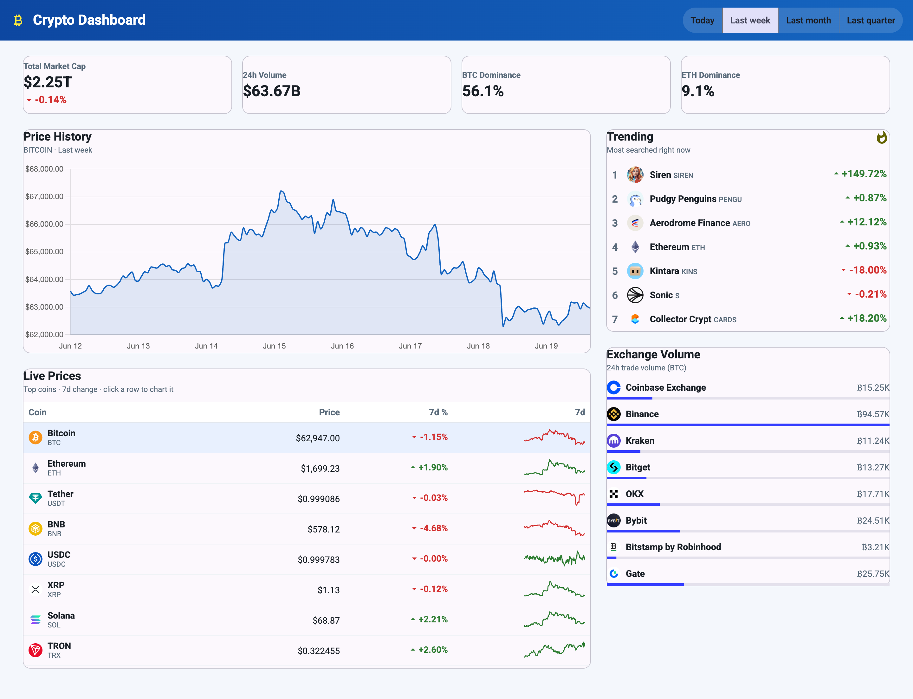
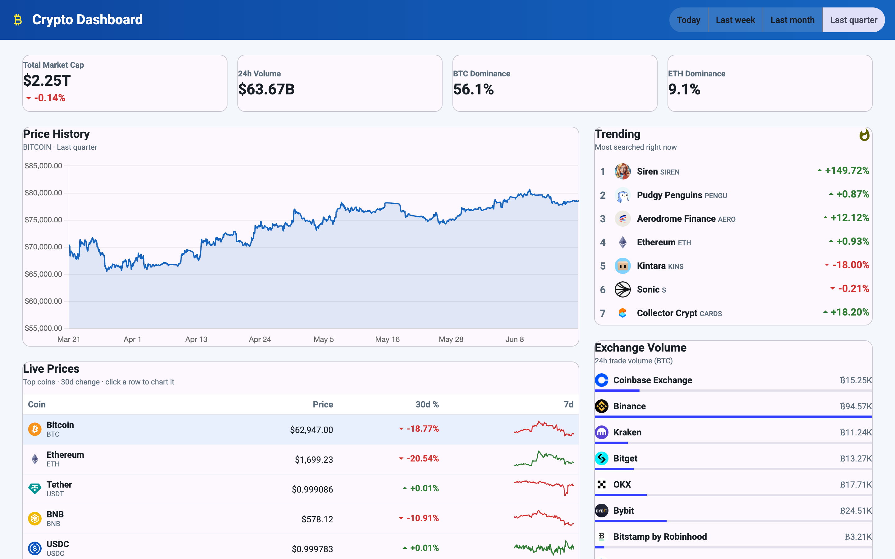
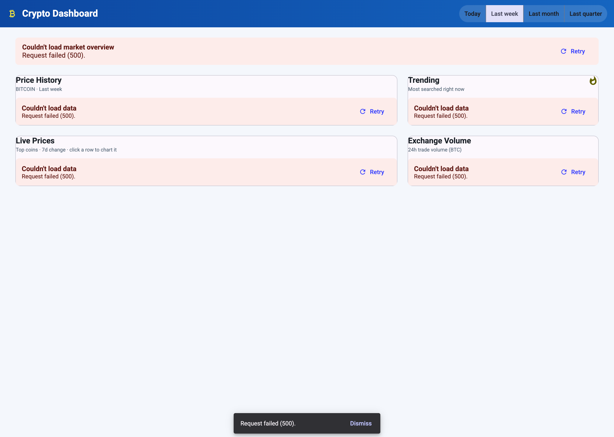
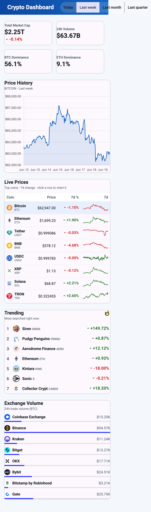

# Crypto Dashboard (v2)

[](https://github.com/benmcosker/crypto-dashboard-v2/actions/workflows/ci.yml)

A real-time cryptocurrency market dashboard built on a **Java Spring Boot** backend and an **Angular + Angular Material** frontend, powered by the live [CoinGecko API](https://docs.coingecko.com/). Successor to the [React/Go v1](https://github.com/benmcosker/crypto-dashboard).

It surfaces five live metrics, all filterable by time period (**Today / Last week / Last month / Last quarter**):

| # | Metric | Source endpoint |
|---|--------|-----------------|
| 1 | Live price, % change & 7-day sparkline | `/coins/markets` |
| 2 | Total market cap + BTC/ETH dominance | `/global` |
| 3 | Price-history chart (per coin) | `/coins/{id}/market_chart` |
| 4 | Trending coins | `/search/trending` |
| 5 | Exchange volume | `/exchanges` |

---

## Table of contents

- [Screenshots](#screenshots)
- [How it works](#how-it-works)
- [Time-period behavior](#time-period-behavior)
- [Prerequisites](#prerequisites)
- [Getting an API key](#getting-an-api-key)
- [Configuration](#configuration)
- [Running the app](#running-the-app)
- [Running the tests](#running-the-tests)
- [Production build](#production-build)
- [Continuous integration](#continuous-integration)
- [API reference](#api-reference)
- [Project structure](#project-structure)
- [Troubleshooting](#troubleshooting)

---

## Screenshots

**Dashboard overview** — all five metrics on one screen, with a time-period filter.



**Time-period filtering** — switching to *Last quarter* re-scales the price-history
chart to 90 days and updates the table's change column to the matching window.



**Graceful error handling** — when the backend or upstream API is unavailable, each
widget shows an inline message with a Retry action, plus a single global toast.



**Responsive layout** — the dashboard reflows to a single column on small screens.

<p align="center">
  
</p>

---

## How it works

```
┌─────────────────────────┐   /api/*    ┌──────────────────────┐  x-cg-demo-api-key  ┌─────────────┐
│ Angular + Material (5173) │ ─────────▶ │ Spring Boot backend (8080) │ ─────────────────▶ │  CoinGecko  │
└─────────────────────────┘  (ng proxy)  └──────────────────────┘   (60s TTL cache)   └─────────────┘
```

- The **Angular app never calls CoinGecko directly.** All requests go to the
  Spring Boot backend, so the API key stays server-side.
- The backend **caches** every upstream response for 60 seconds to stay within
  the CoinGecko demo-plan rate limits and to keep the UI snappy.
- Upstream/transport failures are mapped to a consistent JSON error shape
  `{ error, code, status }` (429 rate-limit + `Retry-After`, 404, 502/504, and
  400 for invalid input). Raw upstream detail is logged, never forwarded.
- In development, the Angular dev server proxies `/api/*` to the backend, so the
  browser stays same-origin (no CORS headaches).

---

## Time-period behavior

The period filter (Today / Last week / Last month / Last quarter) maps to
`1 / 7 / 30 / 90` days. Not every metric has a historical dimension, so the
filter applies where it's meaningful and the rest stay live:

- **Price-history chart** — uses the full day range for the selected period.
- **Live Prices % column** — uses CoinGecko's native change windows
  (24h / 7d / 30d). "Last quarter" has **no native 90-day window**, so the table
  shows the 30d change while the chart still renders the full 90 days.
- **Market overview, Trending, Exchange volume** — live snapshots with no
  historical dimension, so they stay current regardless of the selected period.

---

## Prerequisites

| Tool | Version | Check |
|------|---------|-------|
| **Java (JDK)** | 25 (LTS) | `java -version` |
| **Maven** | 3.9+ (or use the bundled `./mvnw`) | `mvn -version` |
| **Node.js** | 18+ (built/tested on 24) | `node --version` |
| **npm** | 9+ | `npm --version` |

Install Java and Maven if you don't have them:

```bash
# macOS (Homebrew) — openjdk@25 is keg-only
brew install openjdk@25 maven
export JAVA_HOME="$(brew --prefix openjdk@25)/libexec/openjdk.jdk/Contents/Home"
```

---

## Getting an API key

This project uses a **CoinGecko Demo** API key (free).

1. Create an account at <https://www.coingecko.com/en/developers/dashboard>.
2. Generate a **Demo** API key (it looks like `CG-xxxxxxxxxxxxxxxx`).
3. Put it in the `.env` file (see below).

> The backend sends the key as the `x-cg-demo-api-key` header against
> `https://api.coingecko.com/api/v3`. To use a Pro key, override
> `COINGECKO_BASE_URL` to `https://pro-api.coingecko.com/api/v3` and adjust the
> header in `backend/.../config/WebConfig.java`.

---

## Configuration

The backend reads `crypto-dashboard-v2/.env` at startup (a small `DotEnv` loader
walks up from the working directory and copies keys into system properties
before Spring resolves placeholders).

Create `crypto-dashboard-v2/.env`:

```ini
# .env  (required)
COINGECKO_API_KEY=CG-your-demo-key-here

# Optional overrides (defaults shown)
# PORT=8080
# ALLOWED_ORIGIN=http://localhost:5173
# COINGECKO_BASE_URL=https://api.coingecko.com/api/v3
```

| Variable | Default | Purpose |
|----------|---------|---------|
| `COINGECKO_API_KEY` | _(required)_ | Demo API key. |
| `PORT` | `8080` | Backend HTTP port. |
| `ALLOWED_ORIGIN` | `http://localhost:5173` | Origin allowed by CORS (the frontend dev server). |
| `COINGECKO_BASE_URL` | `https://api.coingecko.com/api/v3` | Upstream API base URL. |

The frontend calls a relative `/api` path; the Angular dev server proxies it to
`:8080` (see `frontend/proxy.conf.json`).

---

## Running the app

You need **two terminals** — one for the backend, one for the frontend.

### 1. Backend

```bash
cd backend
./mvnw spring-boot:run
```

You should see it listening on `:8080`. Verify it's up:

```bash
curl http://localhost:8080/api/health
# {"status":"ok","time":"..."}
```

> If `java`/`mvn` aren't found (Homebrew keg-only JDK), set
> `export JAVA_HOME="$(brew --prefix openjdk@25)/libexec/openjdk.jdk/Contents/Home"`
> first.

### 2. Frontend

```bash
cd frontend
npm install        # first time only
npm start          # ng serve on :5173, proxying /api -> :8080
```

Open **<http://localhost:5173>**. The dashboard loads live data immediately and
refreshes prices periodically.

> The frontend hot-reloads on every save (`ng serve`). For the backend, restart
> `./mvnw spring-boot:run` to pick up changes (or add `spring-boot-devtools` for
> auto-restart).

---

## Running the tests

### Backend (JUnit 5)

```bash
cd backend
./mvnw test
```

Covers the CoinGecko client (auth/params/error wrapping via
`MockRestServiceServer`), the TTL cache (hit/miss/expiry), and the controller +
global error mapping (200 pass-through, 400 invalid period, 429/404/502/504).

### Frontend (Karma + Jasmine)

```bash
cd frontend
npm test                                          # interactive (watch)
npx ng test --no-watch --browsers=ChromeHeadless  # one-shot / CI
```

Covers the formatters, the `ApiError` mapping, the percent-change component, and
the period-filter interaction.

### End-to-end (Cypress)

E2E specs drive the real UI in a browser with all `/api/*` calls stubbed via
`cy.intercept`, so they're fast and deterministic — the Spring Boot backend
doesn't need to run.

```bash
cd frontend
npm run e2e             # starts the dev server, runs Cypress headlessly, exits
npm run cy:open        # interactive runner (dev server must already be running)
```

Specs live in `frontend/cypress/e2e/`:

- **`happy.cy.ts`** — all five widgets render with data; the price chart defaults
  to Bitcoin / Last week; the time-period filter refetches the chart and switches
  the table's change column; selecting a coin row or a trending coin updates the
  chart.
- **`sad.cy.ts`** — inline error + Retry on every widget for a 500; the global
  error toast; a 429 rate-limit warning; a network failure; Retry recovery;
  single-widget failure isolation; and the chart's empty-data state.

Stub the API with `cy.stubHappy()` (in `cypress/support/commands.ts`) for the
success case, or override individual endpoints with `cy.intercept(...)` for
failures — fixtures live in `cypress/fixtures/`.

---

## Production build

Build the optimized frontend bundle (output in `frontend/dist/frontend`):

```bash
cd frontend
npm run build
```

Build the backend into a runnable jar:

```bash
cd backend
./mvnw package
java -jar target/backend-0.0.1-SNAPSHOT.jar    # reads ../.env
```

For deployment, serve `frontend/dist/frontend/` from any static host and point
the frontend at your backend. Ensure the backend's `ALLOWED_ORIGIN` matches the
static site's origin.

---

## Continuous integration

Every push and pull request to `main` runs
[`.github/workflows/ci.yml`](.github/workflows/ci.yml):

- **Backend** — `./mvnw -B test` (JUnit) on JDK 25.
- **Frontend** — `npm ci`, `npm run build`, and `ng test` (headless Chrome).
- **E2E** — Cypress runs the `happy` and `sad` specs against the dev server.

---

## API reference

All routes are served by the Spring Boot backend under `/api`. Responses are
CoinGecko JSON, passed through after caching.

| Method | Route | Query params | Description |
|--------|-------|--------------|-------------|
| `GET` | `/api/health` | — | Liveness check. |
| `GET` | `/api/markets` | — | Top 25 coins by market cap, with 7-day sparkline and 1h/24h/7d/30d change windows. |
| `GET` | `/api/global` | — | Total market cap, volume, and dominance percentages. |
| `GET` | `/api/chart/{id}` | `period=today\|week\|month\|quarter` | Price history for a coin over the period (1/7/30/90 days). |
| `GET` | `/api/trending` | — | Currently trending coins. |
| `GET` | `/api/exchanges` | — | Top exchanges by trade volume. |

Examples:

```bash
curl "http://localhost:8080/api/markets"
curl "http://localhost:8080/api/chart/bitcoin?period=quarter"
curl "http://localhost:8080/api/global"
```

---

## Project structure

```
crypto-dashboard-v2/
├── .env                       # COINGECKO_API_KEY (gitignored)
├── README.md
├── CLAUDE.md                  # condensed project notes
│
├── backend/                   # Java 25 · Spring Boot 4.1 · Maven
│   ├── pom.xml
│   ├── mvnw                   # Maven wrapper
│   └── src/main/java/com/bencosker/cryptodashboard/
│       ├── BackendApplication.java   # entrypoint (loads .env, starts Spring)
│       ├── config/            # DotEnv, RestClient + CORS, @ConfigurationProperties
│       ├── client/            # CoinGeckoClient + CoinGeckoException
│       ├── cache/             # TtlCache
│       ├── service/           # DashboardService, TimePeriod
│       └── web/               # DashboardController, GlobalExceptionHandler, ApiError
│
└── frontend/                  # Angular 20 + Angular Material + Chart.js
    ├── angular.json           # dev server :5173 + /api proxy
    ├── proxy.conf.json        # /api -> http://localhost:8080
    ├── cypress.config.ts      # Cypress E2E config
    ├── cypress/
    │   ├── e2e/               # happy.cy.ts + sad.cy.ts
    │   ├── fixtures/          # stubbed API responses
    │   └── support/           # commands (cy.stubHappy) + setup
    └── src/
        ├── styles.scss        # blue/yellow/white Angular Material (M3) theme
        └── app/
            ├── app.ts         # root: toolbar + period/selected-coin state
            ├── models.ts      # types + period mappings
            ├── format.ts      # currency / compact formatters
            ├── components/     # 5 widgets + WidgetCard, PeriodFilter, PercentChange, Sparkline
            ├── services/       # CryptoApi (HttpClient), NotificationService, ApiError
            └── interceptors/   # error.interceptor (typed errors + global toast)
```

---

## Troubleshooting

| Symptom | Fix |
|---------|-----|
| Backend won't start / API calls fail | Ensure `crypto-dashboard-v2/.env` has a valid `COINGECKO_API_KEY`. |
| `Unable to locate a Java Runtime` / `mvn: command not found` | Install `openjdk@25` + `maven`, and set `JAVA_HOME` (see Prerequisites). |
| Widgets show "Couldn't load data" | Make sure the backend is running on `:8080`. Check its console for upstream errors. |
| `429 Too Many Requests` from CoinGecko | Demo-plan rate limit. The 60s cache usually prevents this; wait a minute and reload. |
| `Address already in use` on 8080/5173 | Free it: `lsof -ti tcp:8080 \| xargs kill -9`, or set a different `PORT`. |
| Frontend can't reach the API | In dev, the Angular proxy handles `/api` (`frontend/proxy.conf.json`). |
| `ng test` can't find a browser | Set `export CHROME_BIN="/Applications/Google Chrome.app/Contents/MacOS/Google Chrome"`. |
